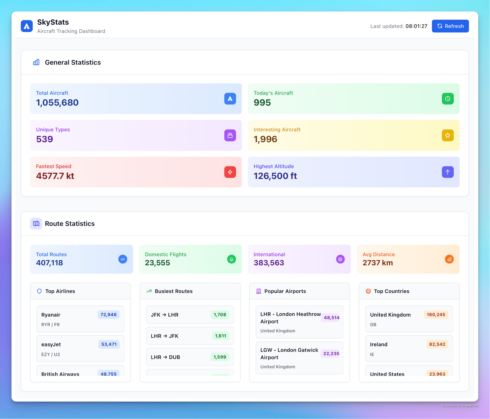
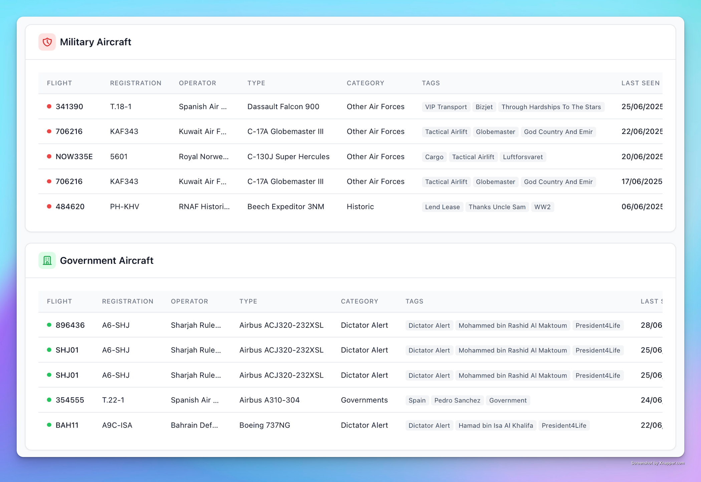
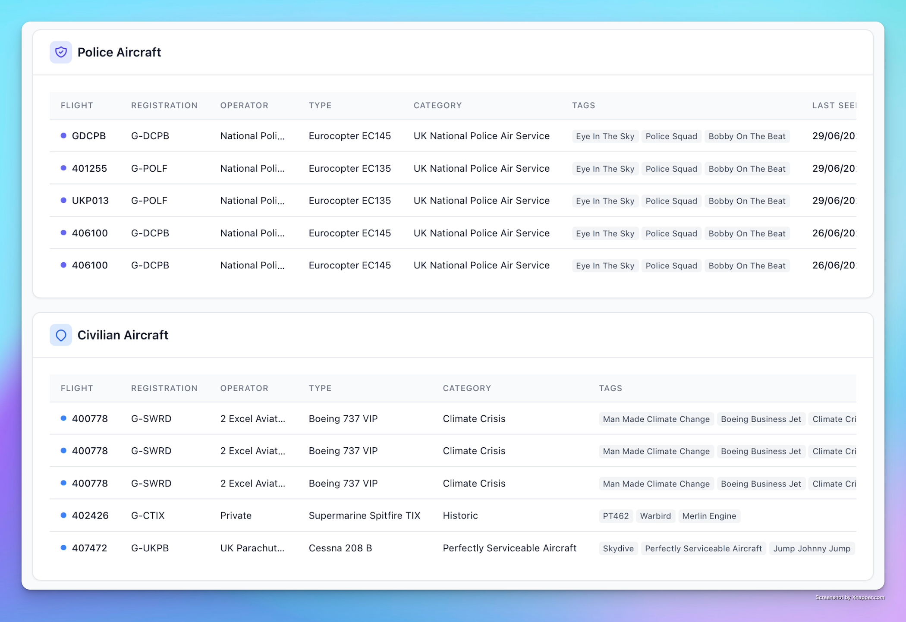
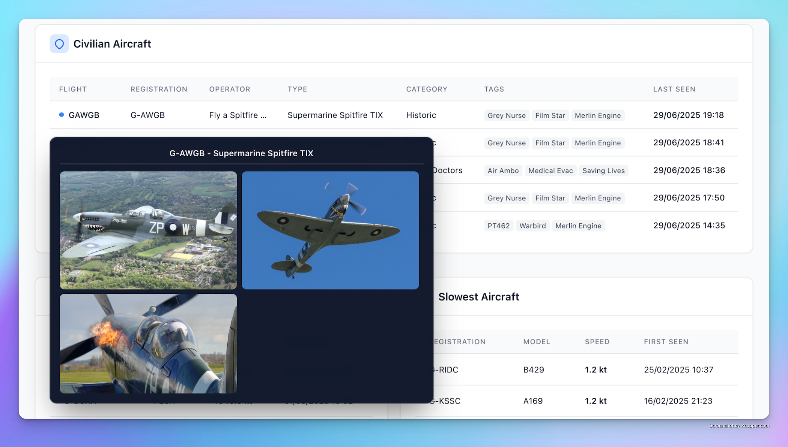
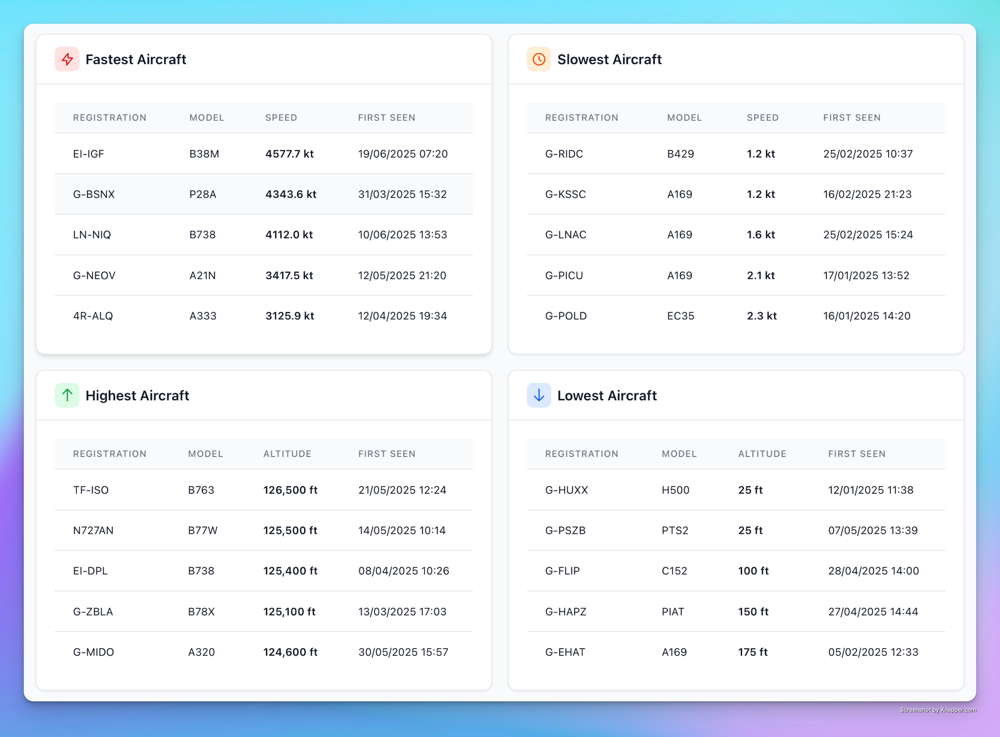

    

 
SkyStats is an application to retrieve, store and display interesting aircraft ADS-B data received via an SDR.
 

## Overview

* Written in Go, using a Postgres database, and a basic html/js website
* ADS-B data is received via [adsb-ultrafeeder](https://github.com/sdr-enthusiasts/docker-adsb-ultrafeeder) / [readsb](https://github.com/wiedehopf/readsb)
* The application reads raw aircraft data from the readsb [aircraft.json](https://github.com/wiedehopf/readsb-githist/blob/dev/README-json.md) file.
* Flight data is stored in a postgres database
* Registration & Routing data is retrieved from the [adsbdb](https://github.com/mrjackwills/adsbdb) API
* "Interesting" aircraft are identified via a local copy of the [plane-alert-db](https://github.com/sdr-enthusiasts/plane-alert-db)
* Various other statistics are (fastest, slowest, highest, lowest) are calculated and stored 
* A [gin](https://gin-gonic.com/) API surfaces information from the postgres database to the web frontend
* Front end built with vanilla html/js - [Claude Code](https://www.anthropic.com/claude-code) was used liberally, as I am not much of a front end developer!

There are environment variables (`LATITUDE`, `LONGITUDE`, `RADIUS`) that can be used to only process aircraft data that falls within a particular boundary - similar to [planefence](https://github.com/sdr-enthusiasts/docker-planefence). Alternatively, setting the `RADIUS` to something larger than that of your SDR will mean all data is processed.

## Screenshots

 

 

 

 
